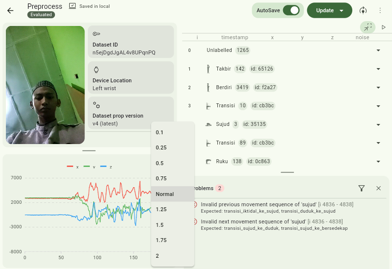
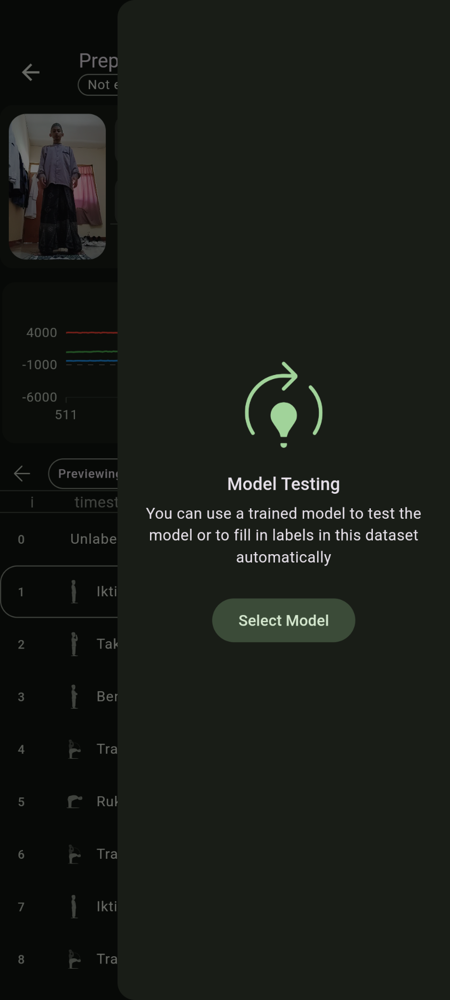
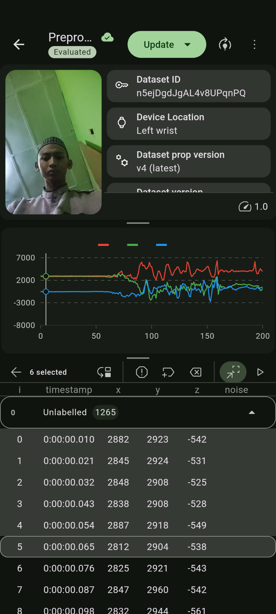
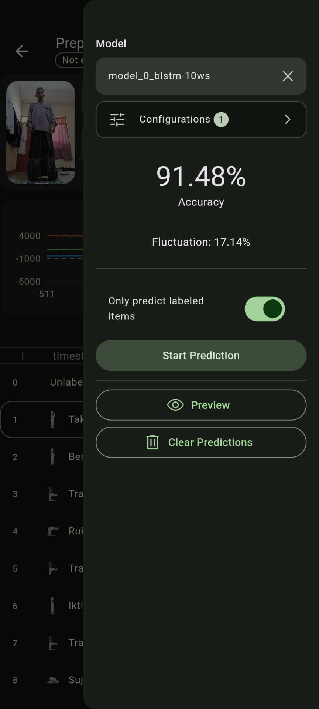
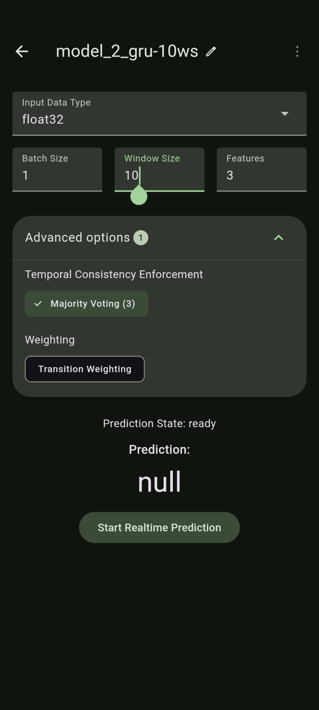
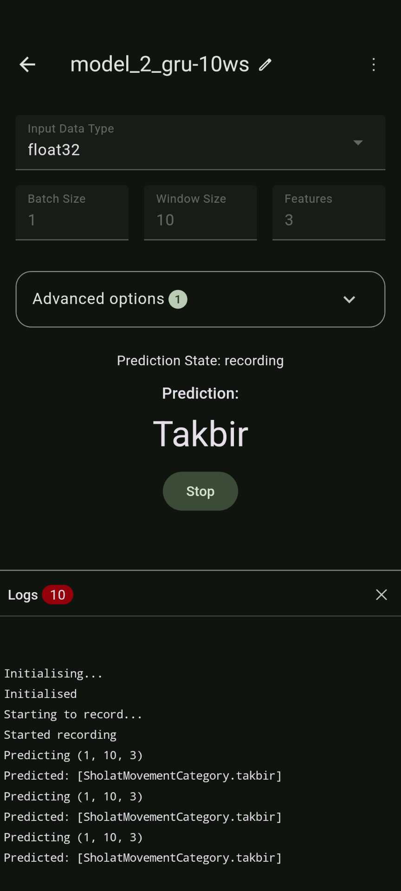

# sholat-ml
## Abstract
The lack of wearable technology utilisation in the religious field, especially to support the practice of prayer, is the background of this research. This prompted the development of a prayer movement detection system using accelerometer data from a smartband. This research aims to apply the Recurrent Neural Network (RNN) algorithm in detecting prayer movements and evaluate its performance. Accelerometer data was collected from the Xiaomi Mi Band 5 device through the ‘sholat-ml’ application developed specifically for this study. The data was then prepared through cleaning, balancing, and data transformation stages before being used to train three RNN models, namely Bidirectional LSTM, LSTM, and GRU. The models were evaluated with various metrics across different window sizes and tested for real-time performance on a mobile phone device. The results show that the GRU model of only 89.53 KB with a window size of 30 and Majority Voting post-processing with threshold 3 provides the most optimal performance, showing an accuracy of 95.38% on real case evaluation and a fluctuation rate of 9.09% even up to 3.23% at threshold 4 surpassing the BLSTM and LSTM models.

Keywords: Prayer Movement Detection, Smartband, Accelerometer, Recurrent Neural Network (RNN), Majority Voting

## Read full paper [here](https://digilib.uinsgd.ac.id/98494/)

## A mobile app used for this model can be found [here](https://github.com/azliR/flutter_sholat_ml)

## Result
Table 1. Comparison of the evaluation results of the BLSTM, LSTM, and GRU models with various window size (window size).

| **Model** | **Total Parameter**    | **_Window size_** | **_Loss_** | **Akurasi** |
| --------- | ---------------------- | ----------------- | ---------- | ----------- |
| BLSTM     | 35.848 (140.03 KB)     | 10                | 0,7210     | 80,93%      |
||| 20        | 0,5806                 | 88,11%            |
||| 30        | **0,5152**                 | 88,55%            |
||| 40        | 0,5503                 | **92,97%**            |
| LSTM      | 30.088 (117.53 KB)     | 10                | 0,5730     | 78,14%      |
||| 20        | 0,5016                 | 83,22%            |
||| 30        | 0,4839                 | 83,88%            |
||| 40        | **0,3799**                 | **89,70%**            |
| GRU       | 22.920  (89.53 KB) | 10                | 0,6011     | 76,05%      |
||| 20        | 0,4249                 | 86,48%            |
||| 30        | 0,3925                 | 86,21%            |
||| 40        | **0,3240**                 | **90,87%**            |

Table 2. Comparison of the results of the evaluation of the real case of BLSTM, LSTM, and GRU models with various window sizes without post-processing and with post-processing majority voting with Threshold 3 and 4.

|  |  | Accuracy |  | | Fluctuation Rate |  |  |
| --- | --- | --- | --- | --- | --- | --- | --- |
| **Model** | **_Window size_** | **Na** | **MV3b** | **MV4c** | **Na** | **MV3b** | **MV4c** |
| BLSTM | 10  | **92,31%** | 91,48% | 88,92% | 36,17% | **17,14%** | 19,44% |
|     | 20  | 93,13% | **93,71%** | 92,21% | 25,00% | 12,50% | **9,68%** |
|     | 30  | 93,27% | **95,24%** | 93,88% | 26,83% | 6,67% | **3,33%** |
|     | 40  | 90,38% | 94,30% | **94,79%** | 17,14% | **13,33%** | 16,67% |
| LSTM | 10  | **91,48%** | 90,08% | 88,33% | 47,37% | **21,05%** | 23,68% |
|     | 20  | **93,71%** | 93,60% | 91,76% | 34,78% | **15,15%** | 20,00% |
|     | 30  | 92,05% | **94,13%** | **94,13%** | 30,23% | **9,68%** | 14,29% |
|     | 40  | 92,19% | **94,34%** | 93,71% | 25,00% | 10,00% | **6,67%** |
| GRU | 10  | **90,08%** | 89,74% | 88,90% | 34,78% | **25,00%** | 30,56% |
|     | 20  | **94,21%** | 93,99% | 91,44% | 25,64% | **14,71%** | 19,44% |
|     | 30  | 92,45% | **95,38%** | 94,68% | 23,08% | 9,09% | **3,23%** |

## Conclusion
Several Recurrent Neural Network (RNN) models have been successfully applied to detect prayer movements from accelerometer data on smartbands, specifically the Xiaomi Mi Band 5. Model development was conducted using the CRISP-DM method. Several model hyperparameter configurations such as learning rate, batch size, and hidden layer have been tested for use in this study. The model configuration used is the Adagrad optimiser with a learning rate of 0.01, batch size of 32, and hidden layer of 64. Model training was conducted using various model variations such as Bidirectional Long Short-Term Memory (BLSTM), Long Short-Term Memory (LSTM), and Gated Recurrent Unit (GRU). Evaluation of model performance is carried out using several metrics including loss, recall, precision, accuracy, and fluctuation rate.

The evaluation results show that the GRU model with a window size of 30 and Majority Voting post-processing with threshold 3 produces the most optimal performance. It achieved 95.38% accuracy in a real test case involving the entire set of movements of the morning prayer with two rak'ahs, including qunut. In addition to high accuracy, the GRU model also showed a low fluctuation rate of only 9.09%, indicating good stability and prediction reliability. 

Beberapa model Recurrent Neural Network (RNN) telah berhasil diterapkan untuk mendeteksi gerakan salat dari data akselerometer pada smartband, khususnya Xiaomi Mi Band 5. Pengembangan model dilakukan dengan metode CRISP-DM. Beberapa konfigurasi hyperparameter model seperti learning rate, batch size, dan hidden layer telah diuji untuk digunakan dalam penelitian ini. Konfigurasi model yang digunakan yaitu optimizer Adagrad dengan learning rate sebesar 0,01, batch size sebesar 32, dan hidden layer sebesar 64. Pelatihan model dilakukan dengan menggunakan berbagai variasi model seperti Bidirectional Long Short-Term Memory (BLSTM), Long Short-Term Memory (LSTM), dan Gated Recurrent Unit (GRU). Evaluasi kinerja model dilakukan dengan menggunakan beberapa metrik diantaranya loss, recall, precision, akurasi, dan fluctuation rate.

Hasil evaluasi menunjukkan bahwa model GRU dengan window size 30 dan post-processing Majority Voting dengan threshold 3 menghasilkan kinerja yang paling optimal. Model ini mencapai akurasi 95,38% dalam pengujian kasus nyata yang melibatkan seluruh rangkaian gerakan salat subuh dengan dua rakaat, termasuk qunut. Selain akurasi yang tinggi, model GRU juga menunjukkan tingkat fluktuasi yang rendah, yaitu hanya 9,09%, mengindikasikan stabilitas dan keandalan prediksi yang baik. 

The performance of the 89.53 KB GRU model surpasses that of the BLSTM and LSTM models.  The BLSTM model of 140.03 KB with a window size of 40 achieves 94.79% accuracy but has a fluctuation rate of 16.67%.  The LSTM model of 117.53 KB with a window size of 30 achieved an accuracy and fluctuation rate of 14.29%. The evaluation results show that the GRU model is able to balance accuracy, prediction stability, generated delay, and model size better than other models.

Overall, this study successfully demonstrated the effectiveness of the RNN algorithm, particularly the GRU model, in detecting prayer movements from smartband accelerometer data. The application of Majority Voting post-processing with the right configuration, as well as the selection of the optimal window size, proved to be able to significantly improve the performance of the model. The relatively small but high-performance GRU model opens up opportunities for the development of smartband-based real-time applications.

## Demo

||
|--|--|
|||
|||
